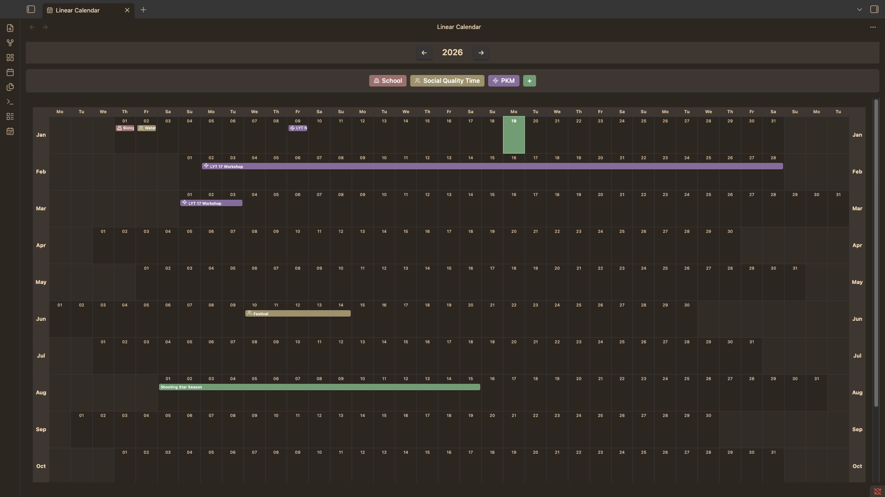
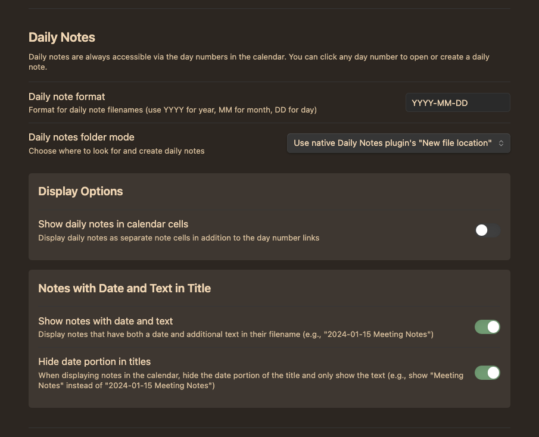
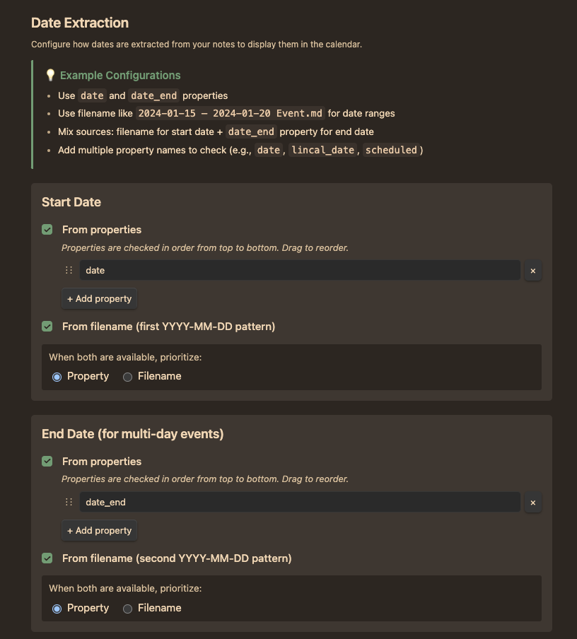
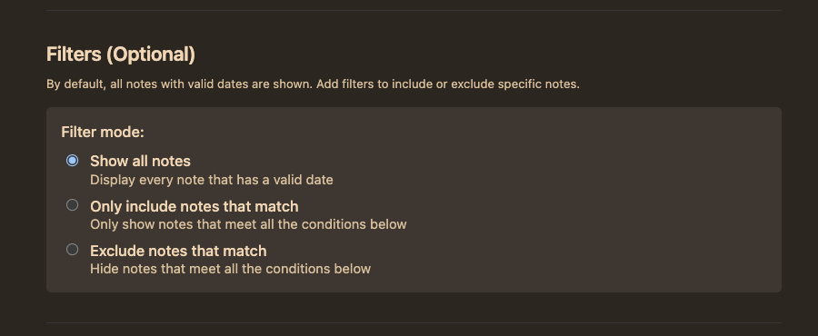

# Linear Calendar for Obsidian

A linear calendar plugin that displays all 365 days of the year in a single view. Perfect for visualizing your notes chronologically, tracking events across time, and managing daily notes.



## ⚠️ Development Status

This plugin is in **early development** and may undergo significant changes. The core functionality—how notes are recognized and dates are extracted—will remain stable. If you use properties or dates in filenames, these will continue to work.

New features are actively being developed. If you encounter any issues or have feedback, please reach out via **[I'll add an email soon]**.

This plugin is being developed with the help of AI.

## ✨ Features

### 📝 Note Display
- **Single-day notes**: Notes appear in their respective day cells
- **Multi-day events**: Events spanning multiple days shown as horizontal bars
- **Clickable notes**: Click any note to open it instantly
- **Instant tooltips**: Hover over any note to see the full title immediately

### 📆 Daily Notes Integration



### 🔍 Flexible Date Extraction

Extract dates from multiple sources with customizable priority:

**Start Date Sources:**
- Properties (configurable, checked in order)
- Filename (first YYYY-MM-DD pattern)
- Choose which source takes priority when both are available

**End Date Sources (for multi-day events):**
- Properties (configurable, checked in order)
- Filename (second YYYY-MM-DD pattern)
- Choose which source takes priority when both are available

**Examples:**
```yaml
---
date: 2024-01-15
date_end: 2024-01-20
---
```

Or use filenames:
- `2024-01-15 Meeting.md` → Single-day note on Jan 15
- `2024-01-15 – 2024-01-20 Conference.md` → Multi-day event Jan 15-20



### 🎨 Customization Options

**Calendar Appearance:**
- **Fit to screen**: Calendar adjusts to available width (default)
- **Scrollable**: Fixed cell widths with horizontal scrolling
- **Configurable cell width**: Set minimum cell width (20-200px) for scrollable mode

**Display Options:**
- Show/hide daily notes in calendar cells
- Show/hide notes with date + text in title
- Optional date hiding: Display "Meeting Notes" instead of "2024-01-15 Meeting Notes"

### 🔎 Advanced Filtering

Filter which notes appear in the calendar:

**Filter Modes:**
- **Show all notes**: Display every note with a valid date (default)
- **Include mode**: Only show notes matching ALL conditions
- **Exclude mode**: Hide notes matching ALL conditions

**Available Conditions:**
- File properties (name, folder, path, extension)
- Custom frontmatter properties
- Text operators: is, contains, starts with, ends with, regex
- Special operators: exists, has tag, matches date pattern

**Example Use Cases:**
- Only show notes in "Projects" folder
- Exclude notes tagged with #draft
- Show only notes with a specific property



## 📥 Installation

### Via BRAT (Recommended)

[BRAT](https://github.com/TfTHacker/obsidian42-brat) (Beta Reviewers Auto-update Tester) is the recommended installation method because it's easy to use and allows you to automatically receive the newest updates.

1. Install the BRAT plugin from Obsidian's Community Plugins
2. Open BRAT settings (Settings → BRAT)
3. Click "Add Beta plugin"
4. Enter this repository: `https://github.com/HomefulHobo/linear-calendar-plugin-obsidian`
5. Click "Select a version"
6. Choose "Latest version"
7. Check "Enable after installing the plugin"
8. Click "Add Plugin"
9. Check if Linear Calendar is enabled in Settings → Community Plugins

### From Obsidian Community Plugins
*Coming soon - plugin will be submitted to the official community plugins directory*

## 🚀 Getting Started

1. **Open the calendar**: Click the calendar icon in the ribbon or use the command palette (Cmd/Ctrl+P → "Open Linear Calendar")

2. **Configure date extraction**: Go to Settings → Linear Calendar → Date Extraction
   - Add property names like `date`, `lincal_date`, or `scheduled`
   - Enable filename extraction if you use dates in filenames
   - Set priority if using both sources

3. **Add notes to your calendar**:
   - Use frontmatter properties:
     ```yaml
     ---
     date: 2024-01-15
     ---
     ```
   - Or include dates in filenames: `2024-01-15 Meeting.md`

4. **Create multi-day events**:
   - Add an end date property:
     ```yaml
     ---
     date: 2024-01-15
     date_end: 2024-01-20
     ---
     ```
   - Or use two dates in filename: `2024-01-15 – 2024-01-20 Conference.md`

5. **Customize appearance**: Adjust calendar width, cell size, and display options in settings

## 🤝 Contributing

Contributions are welcome! Please feel free to email me.

## 💚 Support

If you find this plugin helpful, consider:
- ⭐ Starring the repository
- 🐛 Reporting bugs or requesting features
- 📢 Sharing it with others
